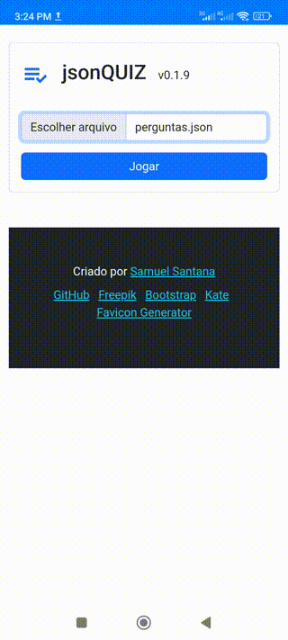

# jsonQUIZ - Crie e Jogue Quizzes Interativos 🎯  

[](https://web.dev/what-are-pwas/)
[](LICENSE)

**Transforme qualquer conteúdo em um quiz divertido e compartilhável!** 

# [INSTALAÇÃO](https://jsonquiz.netlify.app/)

---

## Funcionalidades

**Quiz Personalizado**  
- Importe perguntas via JSON (totalmente customizável)  
- Suporte a imagens, referências e feedback detalhado 

**Multiplos Modos de Jogo**
- Individual (treine sozinho)  
- Multiplayer local (desafie amigos)

**Experiência Premium**  
- PWA (instalável e funciona offline)  
- Animações fluidas e design intuitivo  
- 100% responsivo (mobile, tablet, desktop) 

# [Downloads](https://github.com/samuelsantanaoficial/jsonquiz/releases/latest)

---

## Demonstração  



---

## Como Usar
1. **Escolha o modo de jogo:**
    - Individual
    - Multiplayer local

1. **Carregue suas perguntas**:
   - Clique no botão "Importar JSON"
   - Você pode **baixar perguntas prontas [aqui](https://github.com/samuelsantanaoficial/jsonquiz/releases/latest)**

2. **Jogue com amigos**:
   - Aproveita o aplicativo com seus amigos.

3. **Personalize**:
   - Crie suas próprias perguntas.

---

## Criando Seu Próprio Quiz  
Use a estrutura JSON abaixo (*arquivo completo na pasta* `/dist/`):

```json
[
    {
        "quiz": "Quem escreveu o livro de Atos dos Apóstolos?",
        "a": "João",
        "b": "Lucas",
        "c": "Paulo",
        "d": "Pedro",
        "x": "b",
        "ref": "Atos 1:1"
    },
    {
        "quiz": "Quantos dias Jesus permaneceu na terra após sua ressurreição antes de subir ao céu?",
        "a": "7 dias",
        "b": "12 dias",
        "c": "40 dias",
        "d": "50 dias",
        "x": "c",
        "ref": "Atos 1:3"
    }
]
```

> **Regras de Formatação:**
> 1. Use letras minúsculas em `x` (`a`, `b`, `c`, `d`)
> 2. Sempre coloque vírgula entre perguntas
> 3. Não use espaços após as vírgulas

---

## Licença
Este projeto está sob licença MIT - veja o arquivo [LICENSE](LICENSE) para detalhes.

---

## Contribua
Você pode contribuir com perguntas

---